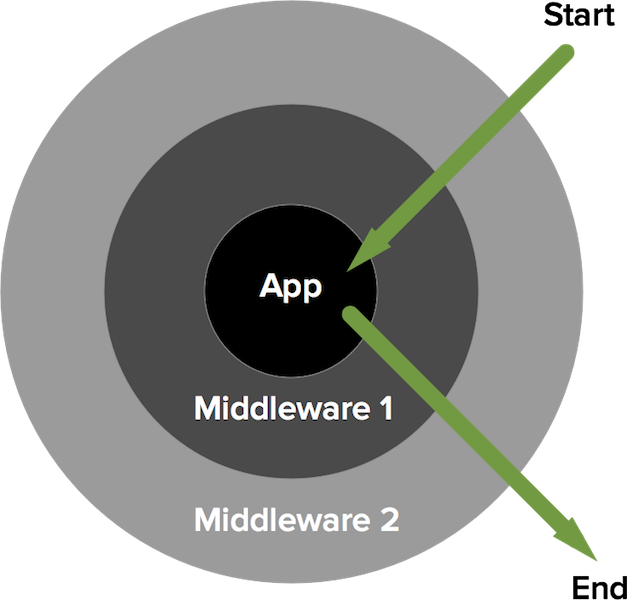

class: title

# Les middlewares en PHP

---

Les middle-what ?

---

.center[  ]

---

```php
$response = middleware($request);
```

---

## Symfony

```php
interface HttpKernelInterface
{
    /**
     * @return Response
     */
    public function handle(Request $request, ...);
}
```

---

## PSR-7

```
composer require psr/http-message
```

- `RequestInterface`
- `ServerRequestInterface`
- `ResponseInterface`
- ...

---

```php
use Psr\Http\Message\ResponseInterface;
use Psr\Http\Message\ServerRequestInterface;

function (ServerRequestInterface $request) : ResponseInterface {
    return new Response('Hello world!');
}
```

.small[
*[Zend Diactoros](https://github.com/zendframework/zend-diactoros)*
]

---
class: title

# Step 1

## write and run a middleware

---

.center[  ]

---

## Step 1: write and run a middleware

Write your first middleware.

The web application (in `index.php`) should show "Hello world!" at [http://localhost:8000](http://localhost:8000/).

---

```php
use Zend\Diactoros\Response\TextResponse;

$application = function (ServerRequestInterface $request) {
    return new TextResponse('Hello world!');
};
```

---
class: title

# Step 2

## use the request

---

## Step 2: use the request

Use the request so that [http://localhost:8000/?name=Bob](http://localhost:8000/?name=Bob) shows "Hello Bob!"

.small[
*Bonus: [http://localhost:8000/](http://localhost:8000/) should still show "Hello world!"*
]

---

```php
$application = function (ServerRequestInterface $request) {
    $queryParams = $request->getQueryParams();
    
    $name = $queryParams['name'] ?? 'world';
    
    return new TextResponse('Hello ' . $name . '!');
};
```

---
class: title

# Step 3

## compose middlewares to handle errors nicely

---

```
$ cat /var/log/apache2/access.log \
        | grep 404 \
        | awk '{ print $7 }' \
        | sort \
        | uniq -c \
        | sort

   1 /blog/wp-content/uploads/2012/12/favicon.ico
   1 /favicon.ico
   1 /login?code=auie&state=auie
  10 /dreams/wp-content/uploads/2016/03/header-bg.png
  33 /description.xml
```

---

.center[  ]

---

.center[  ]

---

# TODO: intro to layers



---

## Step 3: compose middlewares to handle errors

Assemble multiple middlewares with a `Pipe`.

```php
$pipe = new Pipe([
    function (...) { ... },
    function (...) { ... },
]);
```

Write an error handler middleware. Place it first in the pipe. It should catch exceptions thrown in next middlewares and show an error page.

.small[
*Bonus: write the error handler middleware as a class.*
]

---

```php
use Psr\Http\Message\ServerRequestInterface as Request;

$application = new Pipe([

    // Error handler
    function (Request $request, callable $next) {
        try {
            return $next($request);
        } catch (\Exception $e) {
            $m = $e->getMessage();
            return new TextResponse('Error: '.$m, 500);
        }
    },

    // Application
    function (Request $request, callable $next) {
        throw new Exception('Test');
    },

]);
```

---

```php
class ErrorHandler implements Middleware
{
    public function __invoke(Request $request, callable $next)
    {
        try {
            return $next($request);
        } catch (\Exception $e) {
            $whoops = $this->createWhoops();
            $output = $whoops->handleException($e);
            return new HtmlResponse($output, 500);
        }
    }

    private function createWhoops()
    {
        return ...;
    }
}
```

---
class: title

# Step 4

## split the flow with a router

---

# TODO: intro

---


---

## Step 4: split the flow with a router

Use the router to map URLs to handlers (aka controllers).

```php
$router = new Router([
    '/' => function () { ... },
    '/blog/' => function () { ... },
    '/article/{name}' => function () { ... },
]);
```

---

```php
$application = new Pipe([
  new ErrorHandler(),
  new Router([
  
    '/' => function () use ($container) {
        $articles = $container->articleRepository()->getArticles();
        $html = $container->twig()->render('home.html.twig', [
            'articles' => $articles,
        ]);
        return new HtmlResponse($html);
    },
    
    '/about' => function () use ($container) {
        return new HtmlResponse(
            $container->twig()->render('about.html.twig')
        );
    },
      
  ]),
]);
```
